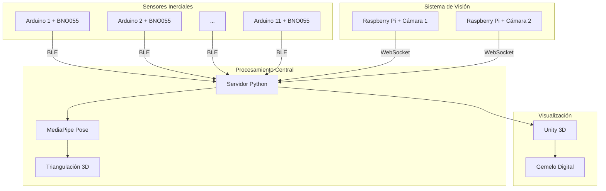

# 🤖 Human Digital Twin - Gemelo Digital Humano

<div align="center">


*Sistema híbrido de captura de movimiento humano en tiempo real*

**Trabajo de Fin de Grado - Ingeniería Informática**  
*Universidad de Almería*

[](https://opensource.org/licenses/MIT)
[]()

</div>

---

## 📖 Descripción del Proyecto

Este proyecto implementa un **sistema de gemelo digital humano** que combina sensores inerciales distribuidos y visión por computadora para crear una representación virtual precisa del movimiento humano en tiempo real. El sistema fusiona datos de orientación de múltiples sensores BNO055 con información posicional obtenida mediante visión estereoscópica y MediaPipe.

### 🎯 Objetivos Principales

- ✅ **Captura de Orientación**: Red de 11 sensores inerciales distribuidos por el cuerpo
- ✅ **Posicionamiento 3D**: Sistema de visión estereoscópica con triangulación
- ✅ **Fusión de Datos**: Integración en tiempo real de orientación y posición
- ✅ **Visualización**: Representación virtual inmersiva en Unity 3D

---

## 🏗️ Arquitectura del Sistema

<div align="center">



</div>

---

## 🔧 Componentes del Sistema

### 📡 Sistema de Orientación
- **11 sensores BNO055** para captura de orientación angular
- **Arduino Nano** con conectividad Bluetooth Low Energy
- **Baterías LiPo** para operación autónoma
- **Carcasas impresas en 3D** para protección y fijación

### 👁️ Sistema de Visión
- **2 Raspberry Pi** con módulos de cámara
- **Calibración estereoscópica** automática
- **MediaPipe Pose** para detección de 33 puntos anatómicos
- **Triangulación DLT** para reconstrucción 3D

### 🖥️ Infraestructura de Procesamiento
- **Servidor central** para fusión de datos multisensoriales
- **Algoritmos de sincronización** temporal
- **Protocolos de comunicación** BLE y WebSockets
- **Motor Unity 3D** para renderizado en tiempo real

---

## 📁 Estructura del Proyecto

```
Human_Digital_Twin/
├── Arduino/                    # Firmware para sensores inerciales
│   └── send_orientation.ino   # Código principal Arduino + BNO055
├── Raspberry/                  # Scripts para sistema de visión
│   ├── 192_168_7_230.py      # Cámara estéreo izquierda
│   └── 192_168_7_231.py      # Cámara estéreo derecha
├── position_orientation/       # Sistema integrado de fusión
│   ├── calibracion.py         # Calibración estereoscópica
│   ├── obtencion_puntos_uv.py # Detección de poses MediaPipe
│   └── send_orientation_position_unity.py  # Servidor principal
├── Unity3D/                   # Scripts Unity para visualización
│   ├── BodyUDPReceiver.cs     # Receptor de datos de posición y orientación absoluta
│   └── OrientationReceiver.cs # Receptor de datos de posición semi-absoluta y orientación absoluta
└── Tests/                     # Herramientas de prueba y desarrollo
    ├── Arduino/               # Tests de sensores
    ├── Orientation_Python_Viz/  # Visualizadores de orientación
    └── Send_Data_Unity/       # Simuladores de datos
```

---

## ⚙️ Instalación y Configuración

### 📋 Requisitos Previos

**Hardware:**
- 11x Arduino Nano
- 11x Sensores BNO055
- 2x Raspberry Pi + Módulos de cámara
- PC con Windows/Linux (16GB RAM recomendado)
- Adaptador Bluetooth 5.0+

**Software:**
- Python 3.8+
- Unity 2022.3 LTS
- Arduino IDE
- OpenCV, MediaPipe, NumPy

### 🚀 Instalación

1. **Clonar el repositorio:**
```bash
git clone https://github.com/augustinbesu/Human_Digital_Twin.git
cd Human_Digital_Twin
```

2. **Instalar dependencias Python:**
```bash
pip install opencv-python mediapipe numpy asyncio websockets
```

3. **Configurar Arduino:**
- Abrir `Arduino/send_orientation.ino`
- Modificar `ARDUINO_NUMBER` para cada sensor (1-11)
- Cargar firmware en cada Arduino

4. **Configurar Raspberry Pi:**
- Ejecutar scripts de cámara: `python 192_168_7_230.py` y `python 192_168_7_231.py`

5. **Calibrar sistema estéreo:**
```bash
cd position_orientation
python calibracion.py
```

6. **Ejecutar sistema principal:**
```bash
python send_orientation_position_unity.py
```

---

## 🎮 Uso del Sistema

### 🏃 Captura en Tiempo Real

1. **Activar sensores:** Encender los 11 módulos Arduino
2. **Iniciar cámaras:** Ejecutar scripts Raspberry Pi
3. **Lanzar servidor:** `python send_orientation_position_unity.py`
4. **Abrir Unity:** Cargar escena con `BodyUDPReceiver` y `OrientationReceiver`
5. **¡Mover!** El gemelo digital replicará los movimientos en tiempo real

### 🔧 Herramientas de Desarrollo

- **Visualizador Euler:** `Tests/Orientation_Python_Viz/visualization_euler_FINAL.py`
- **Visualizador Cuaterniones:** `Tests/Orientation_Python_Viz/visualization_quat_FINAL.py`
- **Grabador de posiciones:** `Tests/Send_Data_Unity/guardar_posicion.py`

---

## 📊 Resultados y Rendimiento

| Métrica | Valor | Descripción |
|---------|-------|-------------|
| **Latencia Total** | < 100ms | Tiempo desde captura hasta visualización |
| **Frecuencia de Muestreo** | 20 Hz | Actualización de sensores y cámaras |
| **Precisión Orientación** | ±2° | Error RMS en medición angular |
| **Precisión Posición** | ±5cm | Error medio en triangulación 3D |
| **Cobertura Corporal** | 11 puntos | Articulaciones principales |

---

## 🔬 Validación Experimental

### ✅ Superioridad de Cuaterniones
- **Eliminación del Gimbal Lock:** Representación matemáticamente estable
- **Continuidad angular:** Sin discontinuidades en ±180°
- **Precisión mejorada:** Interpolación suave entre orientaciones

### ✅ Calibración Estereoscópica
- **Cámara 0:** Error de reproyección 0.163 ± 0.085 píxeles
- **Cámara 1:** Error de reproyección 0.719 ± 0.324 píxeles
- **Triangulación:** 45% de puntos con precisión aceptable

---

## 🚀 Trabajo Futuro

### 🔮 Mejoras Propuestas

- **Escalabilidad:** Expansión a 20+ sensores corporales
- **Visión Multi-Cámara:** Sistema de 4-6 cámaras para cobertura completa
- **Calibración Automática:** Eliminación de configuración manual
- **IA Predictiva:** Detección de patrones y anomalías de movimiento

---

## 👨‍🎓 Información Académica

**Autor:** Augustin Alexandru Besu  
**Universidad:** Universidad de Almería  
**Titulación:** Grado en Ingeniería Informática  
**Año Académico:** 2024-2025  

---

## 📄 Licencia

Este proyecto está licenciado bajo la Licencia MIT - ver el archivo [LICENSE](LICENSE) para más detalles.

---

<div align="center">

</div>
